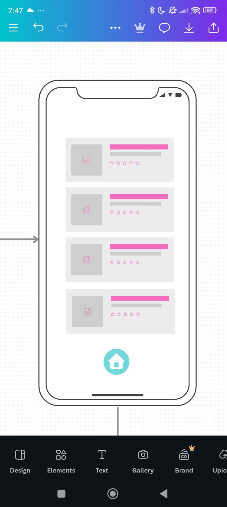
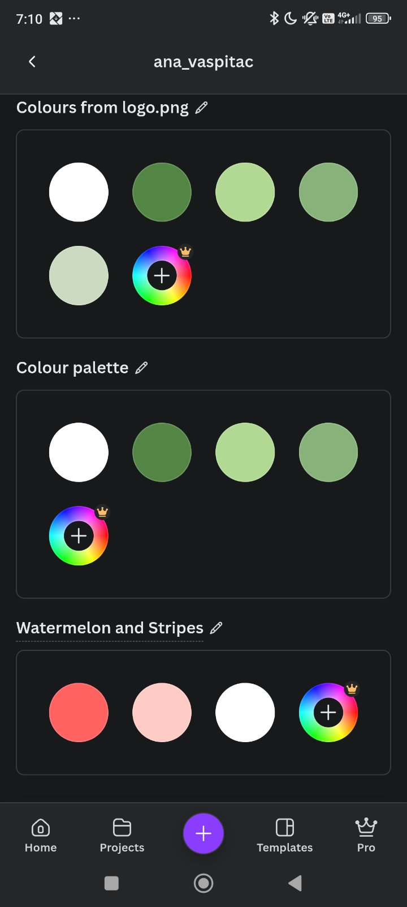
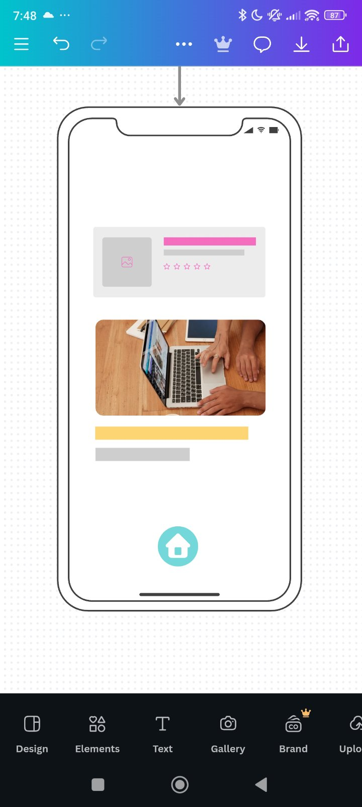
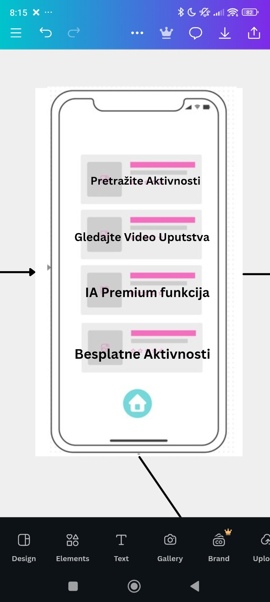
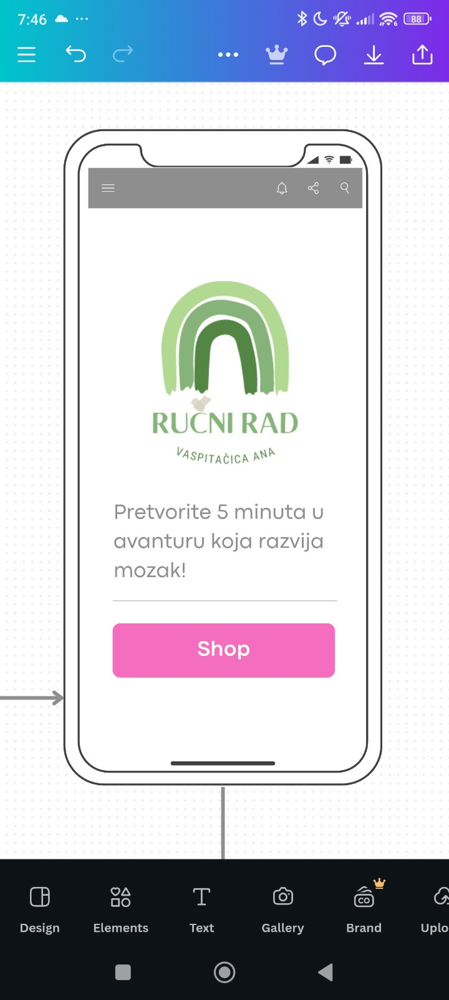
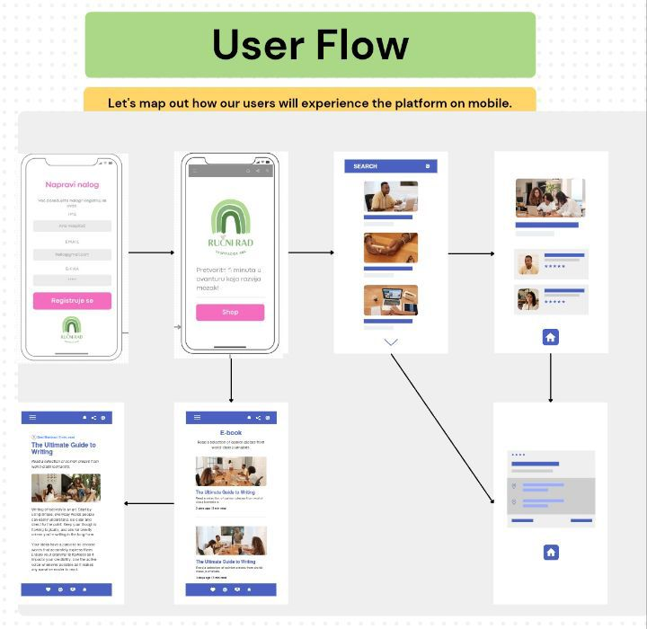

# Kids 5-Minute Activity App - Software Specification

## 1. Project Overview

A cross-platform mobile and web app that delivers simple 5-minute educational and physical activities for kids. The app displays text instructions and associated videos for each activity. The primary language is Serbian, with planned multilingual support.

---

## 2. Target Platforms

- Android (first release)
- Web (PWA-capable)
- iOS (future roadmap)

---

## 3. Functional Requirements

### 3.1. Core Features

- Display list of activities (title, description, video link)
- Play video content directly in-app
- Multi-language support (initial: Serbian, English; expandable)
- Offline access to previously downloaded content
- Automatic content update on app startup (if network available)
- Automatic cleanup of cached video files based on storage thresholds (thresholds can be set, or never)
- Track content version to determine when updates are needed

### 3.2. Administrative Features

- JSON-based content storage for activities, easily updateable
- Remote storage for updated JSON and video files
- Support for multiple language fields in JSON content
- Configuration to allow regular content updates without full app redeployment
- Initial content management manual; future admin portal planned

### 3.3. User Interaction

- Minimalistic UI suitable for parents and educators using **Angular Material** for UI components
- Option to mark activities as completed (MVP optional)
- No user accounts or personal data collected

---

## 4. Non-Functional Requirements

- Performance optimized for low-end Android devices
- Minimal memory usage
- Secure video file access
- Fast app startup
- High offline reliability
- Simple, clear and accessible UI design for parents and educators
- Privacy compliance for children's apps (COPPA, GDPR as applicable)

---

## 5. Architecture Overview

### 5.1. Frontend Technologies

- Angular Framework
- Capacitor (for mobile native build)
- Angular Material (UI component library)
- ngx-translate (language support)
- Service Worker for PWA and offline caching

### 5.2. Backend / Hosting

- Firebase Hosting (static web app hosting, content delivery) — TBD for final hosting/deployment solution
- Firebase Storage (video hosting)
- Google Cloud Storage (optional alternative for future scaling)
- YouTube for initial video content hosting; future video hosting TBD (options include proprietary cloud storage, CDN, or specialized video hosting platforms)
- GitHub repository with CI/CD pipeline (GitHub Actions)

### 5.3. Content Model (JSON Schema)

```json
{
  "version": "1.0.2",
  "languages": ["sr", "en"],
  "activities": [
    {
      "id": "001",
      "title": { "sr": "Joga za decu", "en": "Yoga for Kids" },
      "description": { "sr": "Jednostavna petominutna joga", "en": "Simple 5 minute yoga session" },
      "videoUrl": {
        "sr": "https://storage.googleapis.com/myapp/yoga_sr.mp4",
        "en": "https://storage.googleapis.com/myapp/yoga_en.mp4"
      }
    }
  ]
}
```

### 5.4. Offline Storage Strategy

- Videos downloaded on-demand
- Automatically remove old cached videos based on local storage usage and configurable thresholds (including option for "never")
- LocalStorage or IndexedDB to cache JSON content and version tracking

### 5.5. Update Mechanism

- On app startup:
  - Check for new JSON version
  - Download and cache new JSON if available
  - Keep using cached JSON if no network available

---

## 6. Testing

### 6.1. Testing Types

- Unit Testing (Jasmine + Karma)
- End-to-End Testing (Cypress or Playwright)
- UI Component Testing (optional with Storybook)
- Offline scenario testing
- Device storage pressure testing

### 6.2. CI/CD Integration

- GitHub Actions to run tests on every push

---

## 7. Distribution & Deployment

### 7.1. Web App

- Firebase Hosting
- PWA configuration for offline support

### 7.2. Mobile App

- Capacitor native builds for Android (initial)
- Play Store distribution (Google Play Console setup required)

### 7.3. CI/CD

- Automated builds and deployments via GitHub Actions
- Automated versioning and deployment triggers on content updates

---

## 8. Privacy, Security & Compliance

- No personal data collected (no authentication)
- Privacy Policy and Terms of Use mandatory for store publication
- Secure Firebase Storage rules for video access
- COPPA / GDPR compliance review before public launch
- Privacy and safety emphasized in app description and user messaging

---

## 9. Future Enhancements (Post-MVP)

- iOS platform support
- Push notifications for activity reminders
- User favorites or history
- Simple gamification elements (streaks, badges)
- AI-based activity recommendations
- Cloud CMS integration for non-technical content management
- Admin portal for content management
- Shop module (for future phase)

---

## 10. Timeline

- Development start: TBD
- MVP release: TBD
- Initial platforms: Android & Web

---

## 11. App Description

### 11.1 Short Description

The Kids 5-Minute Activity App is a friendly and professional guide designed to help parents, future parents, and educators engage children up to 7 years old in simple, fun, and educational activities. Each activity encourages both physical and mental development through easy-to-follow instructions and video demonstrations. With quick, accessible ideas that fit into busy schedules, the app makes quality time with kids enjoyable and effective. Perfect for parents looking to support their child's growth with minimal hassle, the app requires no special equipment and works offline for convenience. Privacy is a top priority — no personal data is collected, making it safe and family-friendly.

### 11.2 Detailed Description

The Kids 5-Minute Activity App is a carefully designed resource to support parents, future parents, and educators in fostering the physical and mental development of children up to 7 years old. The app provides a variety of short, engaging activities that can be completed in just five minutes, making it easy to incorporate educational play into any daily routine.

Each activity comes with clear text instructions and accompanying videos to guide users through fun and effective exercises aimed at enhancing children’s cognitive skills, motor abilities, and emotional well-being. The content focuses on quality time and meaningful interaction, emphasizing simple, no-equipment-needed ideas that can be done anywhere.

The app supports multiple languages and offers offline access to downloaded content, ensuring usability regardless of network conditions. Its user interface is designed to be clean, minimalistic, and accessible for parents and educators alike.

Privacy and security are central to the app’s design. No personal data is collected, and the app complies with privacy standards relevant to children’s products, giving families peace of mind.

---

## 12. Content Licensing

- Content will be original, created by the app team
- Content access restricted via app links; not publicly indexed
- No third-party licensed content initially
- Licensing terms and usage rights are documented internally
- Future consideration of formal licenses if third-party content is added

---

## 13. UX Design Specification

### 13.1 Target Audience UX Goals

- Simple navigation for busy parents and educators
- Visual clarity with minimal cognitive load
- Soft, friendly, professional appearance
- Quick access to content with minimal user actions
- Fully functional offline interface

### 13.2 Navigation Structure

- Home Screen (Activity categories)
- Activity List
- Activity Detail (Text + Video)
- Settings (language switch, offline content management)
- No authentication, no complex user flows

### 13.3 UX Patterns

- Large tappable areas for ease of use on mobile
- Rounded corners, soft shadows
- Intuitive bottom navigation for mobile version
- Consistent icon placement and simplified menus
- Instant feedback on actions (downloads, offline sync, errors)

---

## 14. Visual & UX Guidelines

### 14.1 Brand Colors

**Primary Palette (Green - from Logo)**

- White (#FFFFFF)
- Dark Green
- Medium Green
- Light Green Variants

**Accent Palette (Watermelon & Stripes)**

- Watermelon Pink (used for buttons and CTA)
- Light Pink (background elements)

Exact HEX codes to be extracted and finalized from provided Canva files.

### 14.2 Fonts (Suggestions)

- Primary: "Poppins" or "Nunito" (rounded, friendly, professional)
- Backup: "Open Sans" (high readability)

### 14.3 Iconography

- Simple line icons
- Minimal color usage within icons (match primary/secondary palette)
- Rounded corners, child-friendly

### 14.4 Logo Usage

- Flexible placement; usually centered on the home screen
- Clear space around the logo
- Avoid cluttered backgrounds

### 14.5 Button Design

- Rounded corners (pill shape or soft rounded rectangle)
- Primary call-to-action buttons use Watermelon Pink
- Hover/pressed state slightly darker shade

### 14.6 Overall Style Keywords

- Soft, Playful, Calm, Friendly, Professional
- Clean layout, lots of white space
- Subtle playful elements without overwhelming the user

### 15. UX spec images

- 
- 
- 
- 
- 
- 
- 

---

## 16. Open Points (To Be Defined)

- Final exact color HEX codes
- Font confirmation
- Logo placement guidelines if needed
- UX prototype finalization
- Hosting provider for production deployment
- Admin portal for content management (future phase)

---

